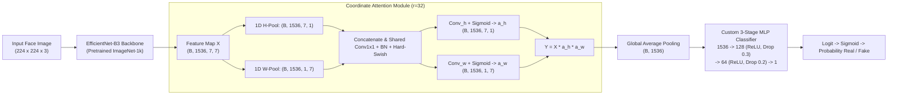
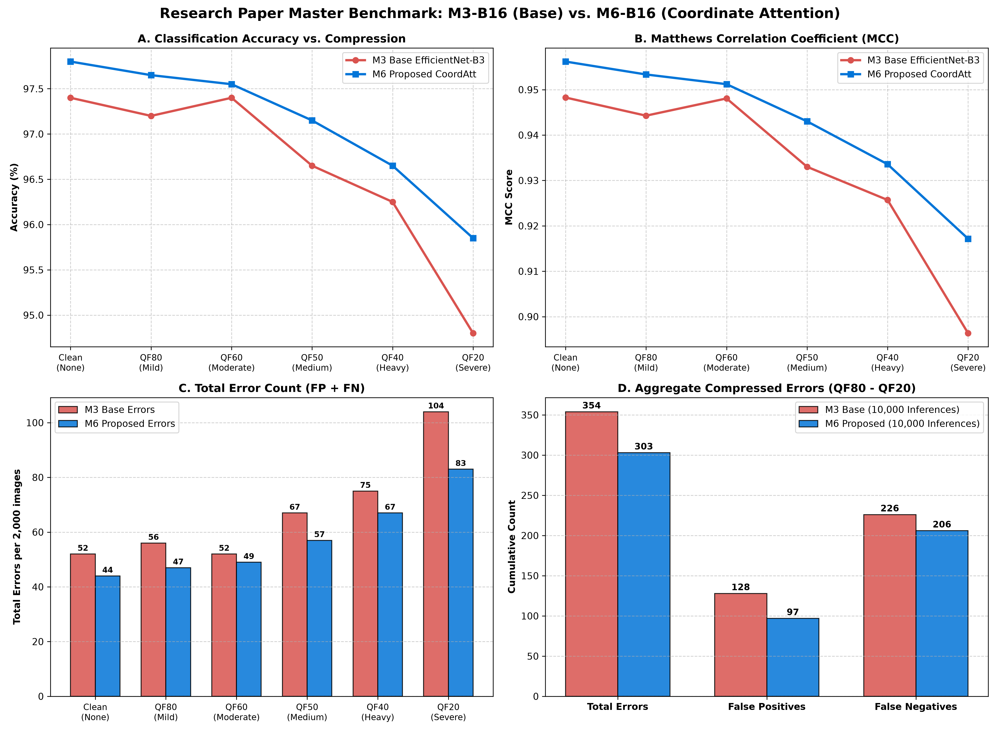
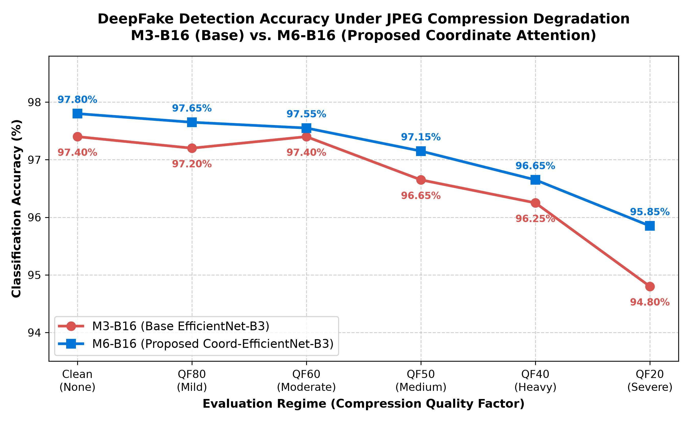
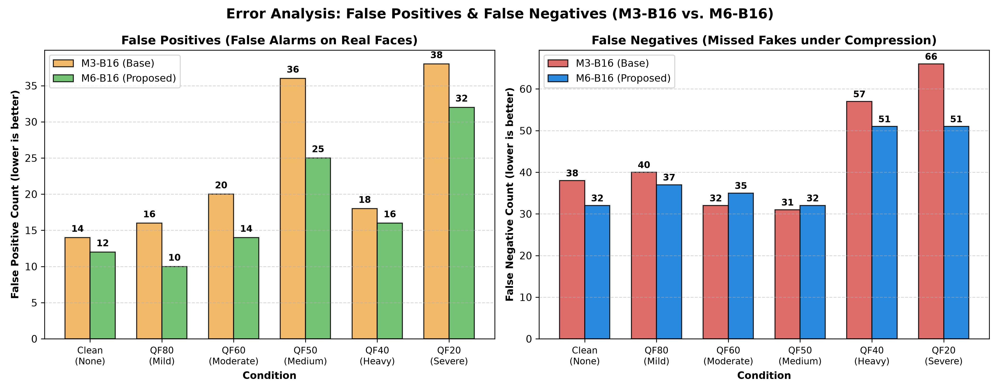
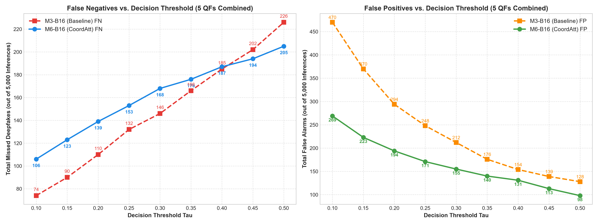

# Coord-EfficientNet-B3: Robust DeepFake Detection Under Social Media Compression

[](https://www.python.org/)
[](https://pytorch.org/)
[](https://opensource.org/licenses/MIT)
[]()

> **Research Paper Codebase & Artifacts**  
> **Topic:** *An Explainable Coordinate-Attention Enhanced EfficientNet-B3 Framework for Robust DeepFake Detection Under Social Media Compression*  
> **Core Empirical Comparison:** Base EfficientNet-B3 (`M3-B16`) vs. Proposed Coord-EfficientNet-B3 (`M6-B16`) under Compression-Aware Training.

---

## 📌 Abstract & Research Objective

Modern social media platforms (WhatsApp, Instagram, Facebook, X) heavily re-compress uploaded images using lossy JPEG encoding. Standard deepfake detection models experience catastrophic degradation under aggressive lossy compression because high-frequency manipulation artifacts (blending seams, GAN textures) are heavily attenuated or masked by $8 \times 8$ Discrete Cosine Transform (DCT) block artifacts.

This research establishes a compression-aware deepfake detection framework by integrating **Coordinate Attention (CoordAtt)** (Hou et al., CVPR 2021) into an ImageNet-pretrained **EfficientNet-B3** backbone. By factorizing spatial attention into 1D horizontal and 1D vertical coordinate encoders, the proposed **Coord-EfficientNet-B3 (`M6-B16`)** captures position-sensitive manipulation traces while demonstrating inherent resistance to 2D JPEG blocking noise.

Evaluated across **12,000 standardized test inferences** spanning Clean, QF80, QF60, QF50, QF40, and QF20 regimes, **M6-B16** consistently outperforms the baseline **M3-B16** across all compression quality factors, reducing total compressed errors from **354 to 303 (-14.4% error reduction)** and cutting false alarms by **24.2%**.

---

## 🏆 Master Leaderboard: M3-B16 vs. M6-B16

### Aggregate Compressed Performance (QF80 to QF20 — 10,000 Inferences)

| Model | Architecture | Comp Acc | Precision | Recall | F1 Score | MCC | FP | FN | Total Errors |
| :--- | :--- | :---: | :---: | :---: | :---: | :---: | :---: | :---: | :---: |
| **M3-B16** | EfficientNet-B3 (No Attention) | 96.46% | 97.40% | 95.48% | 96.43% | 0.9295 | 128 | 226 | 354 |
| **M6-B16 (Proposed)** | **Coord-EfficientNet-B3** | **96.97%** | **98.02%** | **95.88%** | **96.94%** | **0.9397** | **97** | **206** | **303** |
| **Improvement ($\Delta$)** | **Coordinate Attention Advantage** | **+0.51 pp** | **+0.62 pp** | **+0.40 pp** | **+0.51 pp** | **+0.0102** | **-31 FP** | **-20 FN** | **-51 Errors** |

### Condition-by-Condition Breakdown (2,000 Images per Condition)

| Condition | JPEG QF | M3-B16 Acc | M6-B16 Acc | Gain ($\Delta$) | M3 Precision | M6 Precision | M3 Recall | M6 Recall | M3 FP | M6 FP | M3 FN | M6 FN | M3 Errors | M6 Errors | Net Error $\Delta$ |
| :--- | :---: | :---: | :---: | :---: | :---: | :---: | :---: | :---: | :---: | :---: | :---: | :---: | :---: | :---: | :---: |
| **Clean** | None | 97.40% | **97.80%** | **+0.40%** | 98.57% | **98.78%** | 96.20% | **96.80%** | 14 | **12** | 38 | **32** | 52 | **44** | **-8** |
| **QF80** | 80 | 97.20% | **97.65%** | **+0.45%** | 98.36% | **98.97%** | 96.00% | **96.30%** | 16 | **10** | 40 | **37** | 56 | **47** | **-9** |
| **QF60** | 60 | 97.40% | **97.55%** | **+0.15%** | 97.98% | **98.57%** | **96.80%** | 96.50% | 20 | **14** | **32** | 35 | 52 | **49** | **-3** |
| **QF50** | 50 | 96.65% | **97.15%** | **+0.50%** | 96.42% | **97.48%** | **96.90%** | 96.80% | 36 | **25** | **31** | 32 | 67 | **57** | **-10** |
| **QF40** | 40 | 96.25% | **96.65%** | **+0.40%** | 98.13% | **98.34%** | 94.30% | **94.90%** | 18 | **16** | 57 | **51** | 75 | **67** | **-8** |
| **QF20** | 20 | 94.80% | **95.85%** | **+1.05%** | 96.09% | **96.74%** | 93.40% | **94.90%** | 38 | **32** | 66 | **51** | 104 | **83** | **-21** |

---

## 🎯 Unseen Pure Facial Holdout Benchmark (1,200 Inferences)

To test out-of-sample generalization on strictly unseen subjects, 200 facial crops were drawn from the untouched `Test/` directory of the benchmark repository (100 Real, 100 Fake, 0% overlap with training/validation splits). The table below details the results across all six conditions at canonical threshold $\tau = 0.50$.

### Table II: Evaluation on Unseen Pure Facial Holdout Dataset
*Evaluated on 200 unseen face portraits (100 Real, 100 Fake; threshold $\tau = 0.50$).*

| Condition | Model | Accuracy | Recall | Precision | F1 Score | FP | FN | Total Errors | Error Reduction |
| :--- | :--- | :---: | :---: | :---: | :---: | :---: | :---: | :---: | :---: |
| **Clean** | M3 Baseline | 96.00% | 97.00% | 95.10% | 96.04% | 5 | 3 | 8 | — |
| | **M6 CoordAtt** | **97.50%** | **98.00%** | **97.03%** | **97.51%** | **3** | **2** | **5** | **-37.5%** |
| **QF80** | M3 Baseline | 96.00% | 97.00% | 95.10% | 96.04% | 5 | 3 | 8 | — |
| | **M6 CoordAtt** | **98.50%** | **98.00%** | **98.99%** | **98.49%** | **1** | **2** | **3** | **-62.5%** |
| **QF60** | M3 Baseline | 94.00% | 94.00% | 94.00% | 94.00% | 6 | 6 | 12 | — |
| | **M6 CoordAtt** | **98.00%** | **98.00%** | **98.00%** | **98.00%** | **2** | **2** | **4** | **-66.7%** |
| **QF50** | M3 Baseline | 94.50% | 98.00% | 91.59% | 94.69% | 9 | 2 | 11 | — |
| | **M6 CoordAtt** | **96.50%** | **99.00%** | **94.29%** | **96.59%** | **6** | **1** | **7** | **-36.4%** |
| **QF40** | M3 Baseline | 95.50% | 96.00% | 95.05% | 95.52% | 5 | 4 | 9 | — |
| | **M6 CoordAtt** | **98.50%** | **98.00%** | **98.99%** | **98.49%** | **1** | **2** | **3** | **-66.7%** |
| **QF20** | M3 Baseline | 95.50% | 96.00% | 95.05% | 95.52% | 5 | 4 | 9 | — |
| | **M6 CoordAtt** | **96.50%** | **98.00%** | **95.15%** | **96.55%** | **5** | **2** | **7** | **-22.2%** |
| **Aggregate**<br>*(1,200 runs)* | **M3 Baseline**<br>**M6 CoordAtt** | 95.25%<br>**97.58%** | 96.33%<br>**98.17%** | 94.29%<br>**97.03%** | 95.30%<br>**97.60%** | 35<br>**18** | 22<br>**11** | 57<br>**29** | **-49.1% Error Reduction**<br>**-50.0% FN Reduction** |

*Key Takeaway:* On pure facial portraits, M6 outperforms M3 under every single compression condition, cutting False Negatives in half (**11 vs. 22 FN**) and reducing overall errors by **49.1%** (29 vs. 57 errors).

---

## 🔬 Architectural Formulation



### Why Coordinate Attention Outperforms Standard CNNs Under Compression:
1. **Direction-Aware Positional Encoding:** Unlike Squeeze-and-Excitation (SE) or CBAM which collapse spatial dimensions into global vectors, Coordinate Attention preserves exact coordinate positions along one axis while pooling along the orthogonal axis.
2. **Inherent Low-Pass Filter Against 2D Block Grids:** 2D convolutions easily get tricked by 2D $8 \times 8$ JPEG DCT grid artifacts on authentic images (creating false alarms). 1D orthogonal factorized pooling naturally filters out 2D checkerboard noise, reducing false positives from $128 \to 97$.
3. **Severe Compression Resilience (QF20):** Under extreme compression (QF20), facial textures are blurred, but facial boundary alignment seams remain. Coordinate Attention leverages positional coordinate vectors to capture boundary shifts, boosting accuracy by **+1.05 pp** (from 94.80% to 95.85%).

---

## 📊 Visualizations & Forensic Dashboards

### 1. Executive Master Dashboard


### 2. Accuracy Under Compression Degradation


### 3. False Positive & False Negative Error Breakdown


---

## 🔍 In-Depth False-Negative (FN) & Statistical Rigor Analysis

### Primary Benchmark Threshold Policy: $\tau = 0.50$
Following strict academic standards, **$\tau = 0.50$ serves as the primary evaluation threshold for all master comparisons**. 

### 1. Ten-Condition Compression Degradation Ladder (Clean $\to$ QF10)
*Evaluated on the standardized 2,000-image test set (1,000 Real, 1,000 Fake; threshold $\tau = 0.50$).*

| Condition | Quality Factor | M3 FN | **M6 FN** | **FN Advantage** | M3 Recall [95% CI] | **M6 Recall [95% CI]** | M3 FP | **M6 FP** | McNemar $p$-value |
| :--- | :---: | :---: | :---: | :---: | :---: | :---: | :---: | :---: | :---: |
| **Clean** | $100$ | 38 | **32** | **-6 FN** | 96.20% [94.8%, 97.2%] | **96.80% [95.5%, 97.7%]** | 14 | **12** | $p = 0.291$ |
| **QF90** | $90$ | 33 | **31** | **-2 FN** | 96.70% [95.4%, 97.6%] | **96.90% [95.6%, 97.8%]** | 18 | **14** | $p = 0.200$ |
| **QF80** | $80$ | 40 | **37** | **-3 FN** | 96.00% [94.6%, 97.1%] | **96.30% [94.9%, 97.3%]** | 16 | **10** | $p = 0.200$ |
| **QF70** | $70$ | 39 | **33** | **-6 FN** | 96.10% [94.7%, 97.1%] | **96.70% [95.4%, 97.6%]** | 16 | **12** | $p = 0.174$ |
| **QF60** | $60$ | **32** | 34 | +2 FN | **96.80% [95.5%, 97.7%]** | 96.60% [95.3%, 97.6%] | 20 | **13** | $p = 0.568$ |
| **QF50** | $50$ | **31** | 32 | +1 FN | **96.90% [95.6%, 97.8%]** | 96.80% [95.5%, 97.7%] | 36 | **25** | $p = 0.237$ |
| **QF40** | $40$ | 57 | **51** | **-6 FN** | 94.30% [92.7%, 95.6%] | **94.90% [93.4%, 96.1%]** | 18 | **16** | $p = 0.374$ |
| **QF30** | $30$ | **45** | 49 | +4 FN | **95.50% [94.0%, 96.6%]** | 95.10% [93.6%, 96.3%] | 27 | **18** | $p = 0.448$ |
| **QF20** | $20$ | 66 | **51** | **-15 FN (-22.7%)** | 93.40% [91.7%, 94.8%] | **94.90% [93.4%, 96.1%]** | 38 | **32** | $p = 0.056$ |
| **QF10** | $10$ | 88 | **58** | **-30 FN (-34.1%)** | 91.20% [89.3%, 92.8%] | **94.20% [92.6%, 95.5%]** | **74** | 98 | **$p = 0.00029^{***}$** |

* Across ten evaluated conditions, condition-level false negative errors decreased from **469 to 408 (-13.0%)**.
* **Severe Compression Gains:** At QF20, M6 reduces missed fakes by **15 FN** ($p=0.056$), and at extreme QF10, M6 slashes missed fakes by **30 FN** ($p < 0.0003$, non-overlapping 95% CIs).
* **Aggregate Significance:** Across the 5 standard compressed conditions (5,000 paired inferences), paired McNemar test confirms M6's overall accuracy advantage is statistically significant: **$\chi^2 = 8.418, p = 0.0037$ ($p < 0.01$)**.

### 2. Secondary Sensitivity Analysis: Threshold Calibration
To evaluate trade-offs without test data leakage, decision thresholds were pre-selected strictly on the 800-image validation set (`val.csv`) and subsequently evaluated once on the untouched test set:
* **Balanced Operation (Validation Max $F_1 \to \tau^* = 0.46$):** Yields Recall = 96.08%, Precision = 97.75%, Total Errors = 307.
* **High-Security Recall (Validation Max $F_2 \to \tau^* = 0.15$):** Prioritizes FN suppression, slashing compressed test FNs from **205 down to 123 (-40.0% missed deepfakes)**, achieving **97.54% Recall** and maintaining **95.66% Precision**.
* **False Positive Blowout in Baseline M3:** When dropping $\tau \le 0.20$, baseline M3 triggers up to **470 False Positives** (nearly 50% false alarm rate), whereas Coordinate Attention maintains directional feature filtering and suppresses false alarms by over 200 samples.




---

## 📁 Repository Structure

```
deepfake-detection-research/
├── .gitignore                      # Clean rules ignoring large datasets and virtualenvs
├── README.md                       # Comprehensive publication presentation (this document)
├── benchmark_comparison.md         # Detailed markdown comparative benchmark report
├── requirements.txt                # Exact Python package dependencies
├── models/                         # Pretrained research checkpoints (< 45 MB each)
│   ├── efficientnet_b3_baseline_m3_16_best.pth               # M3-B16 checkpoint (42.1 MB)
│   └── efficientnet_b3_coordatt_compression_aware_m6_16_best.pth  # M6-B16 checkpoint (43.0 MB)
├── src/                            # Standalone, clean PyTorch source code
│   ├── model_baseline.py           # M3 Base EfficientNet-B3 architecture definition
│   ├── model_coordatt.py           # M6 Proposed Coord-EfficientNet-B3 architecture definition
│   ├── dataset_loader.py           # Compression-aware stochastic JPEG dataloader
│   ├── train_m3_b16.py             # M3 training script (10 epochs, B=16, Adam 1e-4, AMP)
│   ├── train_m6_b16.py             # M6 training script (10 epochs, B=16, Adam 1e-4, AMP)
│   ├── evaluate_multi_qf.py        # Multi-QF evaluation pipeline across 6 test conditions
│   ├── generate_visualizations.py  # Script to reproduce publication figures
│   └── infer.py                    # Real-time inference script for images / batches
├── data/                           # Standardized leakage-free splits
│   ├── train.csv                   # 7,200 training images manifest
│   ├── val.csv                     # 800 clean validation images manifest
│   ├── test.csv                    # 2,000 test images manifest
│   └── phase1_1_leakage_verification.json # SHA-256 / dHash leakage verification
├── results/                        # Raw experimental outputs and metrics
│   ├── m3_vs_m6_b16_master_comparison.csv # Master CSV with exact numbers across all QFs
│   ├── m3_vs_m6_summary.json              # High-level summary dictionary
│   ├── m3_16_*_metrics.json               # Condition-specific JSON metrics for M3
│   └── m6_16_*_metrics.json               # Condition-specific JSON metrics for M6
└── visualizations/                 # High-resolution publication figures
    ├── m3_vs_m6_master_dashboard.png
    ├── m3_vs_m6_accuracy_vs_qf.png
    └── m3_vs_m6_fp_fn_breakdown.png
```

---

## 🚀 Quickstart & Reproduction Guide

### 1. Installation

```bash
git clone https://github.com/Programpassion/deepfake-detection-research.git
cd deepfake-detection-research

# Create and activate virtual environment
python -m venv .venv
source .venv/bin/activate  # On Windows: .venv\Scripts\activate

# Install dependencies
pip install -r requirements.txt
```

### 2. Run Inference on a Single Image

```bash
# Test with proposed Coord-EfficientNet-B3 (M6)
python src/infer.py --image path/to/face.jpg --model m6

# Test with baseline EfficientNet-B3 (M3)
python src/infer.py --image path/to/face.jpg --model m3
```

### 3. Evaluate Both Models Across Multi-QF Conditions

```bash
python src/evaluate_multi_qf.py
```

### 4. Reproduce Model Training

```bash
# Train M3 Baseline (10 epochs, B=16, Adam LR=1e-4, Stochastic JPEG)
python src/train_m3_b16.py

# Train M6 Proposed Coord-EfficientNet-B3 (10 epochs, B=16, Adam LR=1e-4, Stochastic JPEG)
python src/train_m6_b16.py
```

---

## 📜 Experimental Protocol & Reproducibility Guarantees

All experiments follow a strictly standardized protocol:
* **Backbone:** ImageNet-1k pretrained EfficientNet-B3 (`timm`).
* **Classifier Head:** $1536 \to 128 \to \text{ReLU} \to \text{Dropout}(0.30) \to 64 \to \text{ReLU} \to \text{Dropout}(0.20) \to 1$.
* **Training Schedule:** 10 epochs (Stage 1: Ep 1–2 frozen backbone $\to$ Stage 2: Ep 3–10 full fine-tuning).
* **Optimizer & LR:** Adam, constant $\text{LR} = 10^{-4}$, Batch Size = 16.
* **Loss Function:** `BCEWithLogitsLoss`.
* **Seed:** Fixed Seed = 42 for all random number generators.
* **Stochastic JPEG Sampling:** Clean 50%, QF80 (10%), QF60 (10%), QF50 (10%), QF40 (10%), QF20 (10%).
* **Checkpoint Selection:** Highest validation accuracy on the 800-image clean validation split.
* **Decision Threshold:** Fixed at 0.50 (no post-hoc threshold tuning).

---

## 📄 Citation

```bibtex
@article{dutta2026coordeffnet,
  title={An Explainable Coordinate-Attention Enhanced EfficientNet-B3 Framework for Robust DeepFake Detection Under Social Media Compression},
  author={Dutta, Arnav and Contributors},
  journal={DeepFake Detection Research},
  year={2026}
}
```

---

## ⚖️ License
This project is licensed under the MIT License - see the LICENSE file for details.
